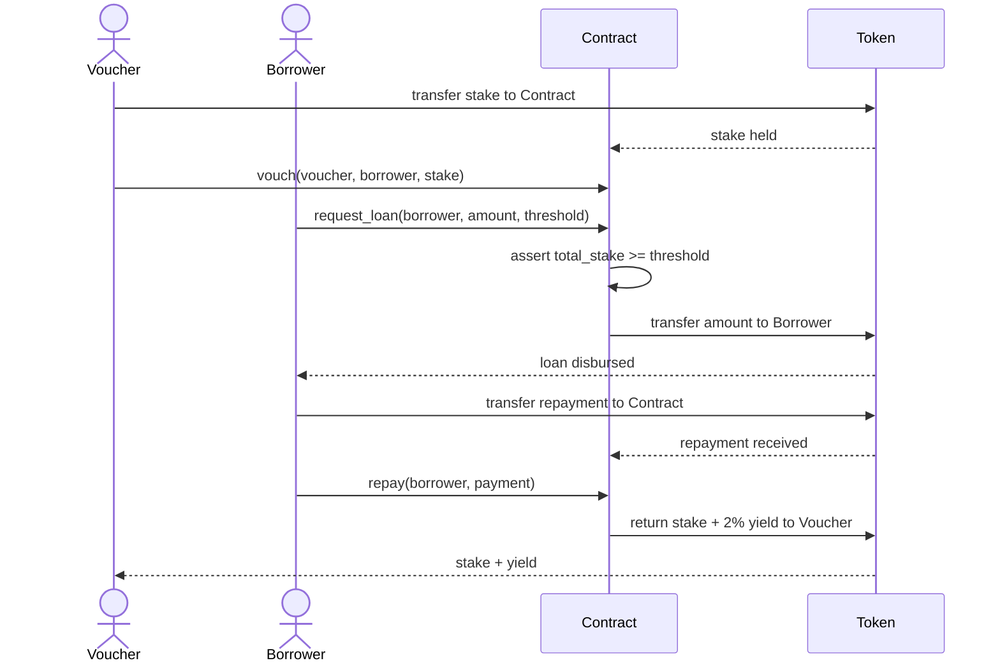
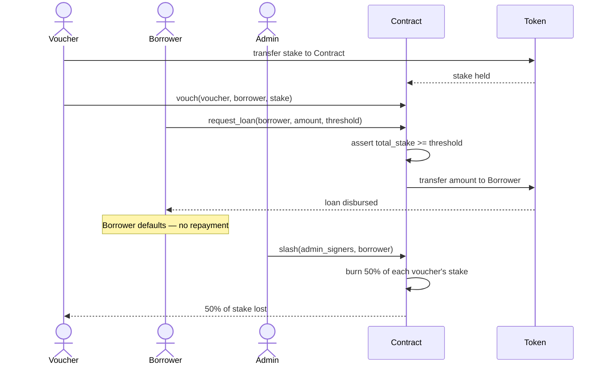
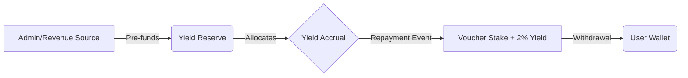

# QuorumCredit — Proof of Trust (PoT) Microlending

> Trustless microlending powered by your social trust graph — built on Stellar Soroban.

Platform: Stellar Soroban | Language: Rust | License: MIT

[](https://codecov.io/gh/your-org/QuorumCredit)

---

## About

QuorumCredit is a decentralized microlending platform that replaces asset collateral with **social collateral**. Inspired by Stellar's **Federated Byzantine Agreement (FBA)**, it lets communities vouch for borrowers using staked XLM — no over-collateralization required.

Traditional DeFi lending demands $100 locked up to borrow $50. QuorumCredit flips this: your trust network is your collateral. Vouchers stake XLM to back a borrower. If the loan is repaid, vouchers earn yield. If the borrower defaults, vouchers are slashed.

This platform is designed for developers building on Stellar, fintech teams targeting underserved communities, and anyone exploring social-trust-based credit systems.

---

## Table of Contents

- [Quick Start](#quick-start)
- [How It Works](#how-it-works)
- [Project Structure](#project-structure)
- [Setup Instructions](#setup-instructions)
- [Testing](#testing)
- [Deployment](#deployment)
- [Architecture](#architecture)
- [Error Reference](#error-reference)
- [Contributing](#contributing)

---

## Quick Start

```bash
# Clone the repository
git clone https://github.com/your-org/QuorumCredit.git
cd QuorumCredit

# Build the contract
cd QuorumCredit
cargo build --target wasm32-unknown-unknown --release

# Run tests
cargo test
```

---

## How It Works

### 1. Vouching
Users stake XLM to vouch for a borrower in their network. This stake is transferred into the contract and held as social collateral.

### 2. Loan Eligibility
A borrower becomes eligible once their total vouched stake meets the minimum threshold — no personal collateral needed.

### 3. Repayment & Default

| Outcome | Borrower | Vouchers |
|---|---|---|
| Loan repaid ✅ | Debt cleared, credit history improves | Earn 2% yield on staked XLM |
| Default ❌ | Flagged, future borrowing restricted | 50% of stake slashed |

> **Minimum stake for yield:** A vouch must be at least **50 stroops** to earn non-zero yield.
> At the default 2% rate (200 bps), `stake * 200 / 10_000` truncates to zero for any stake
> under 50 stroops. The contract enforces this minimum in `vouch()` and rejects smaller stakes
> with a clear error rather than silently paying no yield.

### The FBA Inspiration

Stellar nodes select their own **Quorum Slice** — a trusted subset of peers. QuorumCredit mirrors this: each borrower's eligibility is determined by their personal trust graph, not a central credit bureau. You aren't trusting a bank; you're trusting a specific slice of your social network.

---

## Project Structure

```
QuorumCredit/
├── QuorumCredit/
│   ├── Cargo.toml          # Contract crate (Soroban SDK)
│   └── src/
│       └── lib.rs          # Contract: initialize, vouch, request_loan, repay, slash
├── Cargo.toml              # Workspace root
└── README.md               # This file
```

**Key contract entry points:**

| Function | Description |
|---|---|
| `initialize(deployer, admin, token)` | One-time setup — deployer must sign; sets admin and XLM token address |
| `vouch(voucher, borrower, stake)` | Stake XLM to back a borrower |
| `request_loan(borrower, amount, threshold)` | Disburse loan if stake threshold is met |
| `repay(borrower)` | Repay loan; vouchers receive 2% yield |
| `slash(borrower)` | Admin marks default; 50% of voucher stakes burned |
| `get_loan(borrower)` | Read a borrower's active loan record |
| `get_vouches(borrower)` | Read all vouches for a borrower |

---

## 🛡️ Access Control Matrix

| Function | Role Required | Description | Impact |
|---|---|---|---|
| `initialize` | **Deployer** | One-time setup of Admin and Token addresses. | Sets security foundation. |
| `vouch` | **Voucher** | Stake XLM to back a borrower. | Increases borrower trust score. |
| `request_loan` | **Borrower** | Withdraw loan funds to borrower wallet. | Disburses capital. |
| `repay` | **Borrower** | Clear debt and distribute yield to vouchers. | Restores trust and rewards vouchers. |
| `slash` | **Admin** | Signal default and burn 50% of voucher stakes. | Penalizes default; enforces risk. |
| `get_loan` | **Anyone** | Read active loan records. | Transparency. |
| `get_vouches` | **Anyone** | Read voucher lists for a borrower. | Transparency. |

---

## Setup Instructions

### Requirements

- Rust (latest stable)
- Stellar CLI (`stellar-cli`)
- A Stellar account (for deployment)

### 1. Install Rust

```bash
curl --proto '=https' --tlsv1.2 -sSf https://sh.rustup.rs | sh
rustup target add wasm32-unknown-unknown
```

### 2. Install Stellar CLI

```bash
cargo install --locked stellar-cli
stellar --version
```

### 3. Configure Networks

```bash
# Testnet (recommended for development)
stellar network add testnet \
  --rpc-url https://soroban-testnet.stellar.org:443 \
  --network-passphrase "Test SDF Network ; September 2015"

# Mainnet
stellar network add mainnet \
  --rpc-url https://rpc.mainnet.stellar.org:443 \
  --network-passphrase "Public Global Stellar Network ; September 2015"
```

### 4. Environment Variables

Create a `.env` file (never commit this):

```bash
NETWORK=testnet
DEPLOYER_SECRET_KEY="SB..."   # Your deployer secret key
ADMIN_ADDRESS="GB..."         # Admin account address
TOKEN_CONTRACT="..."          # XLM token contract address
```

> ⚠️ Add `.env` to your `.gitignore`. Never commit secret keys.

---

## Testing

```bash
# Run all tests
cd QuorumCredit
cargo test

# Run with output
cargo test -- --nocapture

# Run a specific test
cargo test test_repay_gives_voucher_yield
```

**Test coverage:**

| Test | Verifies |
|---|---|
| `test_vouch_and_loan_disbursed` | Loan record created, funds transferred to borrower |
| `test_repay_gives_voucher_yield` | Voucher receives original stake + 2% yield |
| `test_slash_burns_half_stake` | Voucher loses 50% of stake on default |
| `test_unauthorized_initialize_rejected` | `initialize` panics when called without deployer's signature |

---

## Deployment

### Security: Deployer-Gated Initialization

`initialize` requires the `deployer` address to sign the transaction (`deployer.require_auth()`). This closes the front-running window that exists between contract deployment and initialization:

1. An attacker observing the deployment transaction on-chain cannot call `initialize` first — they cannot forge the deployer's signature.
2. The deployer address is stored in contract storage (`DataKey::Deployer`) for auditability.

**Required deployment sequence — do not deviate:**

```
Step 1: Build the WASM
Step 2: Deploy the contract  ← deployer keypair signs this tx
Step 3: Initialize the contract ← SAME deployer keypair must sign this tx
```

If steps 2 and 3 are not signed by the same keypair, `initialize` will panic and the contract remains uninitialized.

### Deploy to Testnet

```bash
# Build
cargo build --target wasm32-unknown-unknown --release

# Step 1 — Deploy (note the returned CONTRACT_ID)
stellar contract deploy \
  --wasm target/wasm32-unknown-unknown/release/quorum_credit.wasm \
  --network testnet \
  --source $DEPLOYER_SECRET_KEY

# Step 2 — Initialize immediately after deploy, using the SAME source key
# deployer = the account that signed the deploy tx above
stellar contract invoke \
  --id $CONTRACT_ID \
  --fn initialize \
  --network testnet \
  --source $DEPLOYER_SECRET_KEY \
  -- \
  --deployer $DEPLOYER_ADDRESS \
  --admin $ADMIN_ADDRESS \
  --token $TOKEN_CONTRACT
```

> The `--source` key for `invoke` must match `--deployer`. Using any other key will cause `require_auth()` to reject the call.

### Deploy to Mainnet

> ⚠️ Production checklist before deploying:
> - [ ] All tests passing
> - [ ] Security audit completed
> - [ ] Testnet deployment verified
> - [ ] Admin keys secured (multisig recommended)
> - [ ] Token contract address confirmed

```bash
stellar contract deploy \
  --wasm target/wasm32-unknown-unknown/release/quorum_credit.wasm \
  --network mainnet \
  --source $DEPLOYER_SECRET_KEY
```

### Upgrading the Contract

The `upgrade` function allows the admin (or multisig quorum) to replace the contract WASM after deployment. This is the only path to patching a live vulnerability.

**Upgrade process:**

```
Step 1: Build the new WASM
Step 2: (Recommended) Pause the contract to halt user activity
Step 3: Upload the new WASM and obtain its hash
Step 4: Call upgrade() — requires admin_threshold signatures
Step 5: Unpause the contract
```

```bash
# Step 1 — Build
cargo build --target wasm32-unknown-unknown --release

# Step 2 — Pause (recommended)
stellar contract invoke \
  --id $CONTRACT_ID --fn pause --network testnet --source $ADMIN_SECRET_KEY \
  -- --admin_signers '["'$ADMIN_ADDRESS'"]'

# Step 3 — Upload new WASM, capture the returned hash
NEW_WASM_HASH=$(stellar contract install \
  --wasm target/wasm32-unknown-unknown/release/quorum_credit.wasm \
  --network testnet \
  --source $ADMIN_SECRET_KEY)

# Step 4 — Upgrade (admin_threshold admins must sign)
stellar contract invoke \
  --id $CONTRACT_ID --fn upgrade --network testnet --source $ADMIN_SECRET_KEY \
  -- \
  --admin_signers '["'$ADMIN_ADDRESS'"]' \
  --new_wasm_hash $NEW_WASM_HASH

# Step 5 — Unpause
stellar contract invoke \
  --id $CONTRACT_ID --fn unpause --network testnet --source $ADMIN_SECRET_KEY \
  -- --admin_signers '["'$ADMIN_ADDRESS'"]'
```

> ⚠️ The `upgrade` call requires `admin_threshold` distinct admin signatures — the same multisig quorum used for all other admin operations. A single compromised key cannot unilaterally upgrade the contract.

---

## Architecture

```
Borrower
   └── requests loan
         └── Trust Circle (Quorum Slice)
               ├── Voucher A — stakes XLM
               ├── Voucher B — stakes XLM
               └── Voucher C — stakes XLM
                     └── Threshold met → Loan disbursed
                           ├── Repaid → Vouchers earn 2% yield
                           └── Default → 50% of stakes slashed
```

### Loan Lifecycle: Repay Flow



### Loan Lifecycle: Slash Flow



**Key concepts:**

- **Proof of Trust (PoT):** Social collateral replaces asset collateral
- **Quorum Slice:** Your personal set of trusted vouchers, mirroring FBA logic
- **Slash Mechanism:** Vouchers lose 50% of stake on borrower default — aligning incentives
- **Yield on Trust:** Vouchers earn 2% yield for backing reliable borrowers

**Why Stellar?**

- Near-zero transaction fees — critical for microlending viability
- Fast finality (~5s) — practical for real-world loan cycles
- Soroban smart contracts — expressive enough for trust graph logic
- Native XLM — no bridging complexity for staking and disbursement

---

## 💰 Yield Accounting & Solvency

QuorumCredit uses a **Sustainable Pre-funding Model** for yield distribution. Unlike many DeFi protocols, yield is not "minted" into existence, ensuring no inflationary pressure on the underlying XLM asset.

### Funding Source
Yield is sourced from a dedicated **Yield Reserve** within the contract. For vouchers to earn their 2% yield (`YIELD_BPS = 200`), the contract must be pre-funded by the protocol admin or through external revenue streams (e.g., protocol fees). 

> [!IMPORTANT]
> The contract must hold sufficient XLM to cover both the principal repayment and the 2% yield. If the reserve is empty, the protocol cannot disburse rewards.

### Solvency & "Hard-Cap" Logic
To ensure the protocol never owes more than it holds, a **Hard-Cap Solvency** model is enforced:
1. **Reserve Check**: The protocol only allows loan disbursement if the contract has sufficient liquidity to cover the loan amount.
2. **Yield Protection**: If the Yield Reserve is depleted, the $2.0\%$ yield accrual effectively halts. In the current implementation, any attempt to pay out yield without sufficient funds will trigger a Soroban `InsufficientFunds` panic, protecting the protocol's integrity.

### Yield Flow Diagram



## Error Reference

All contract errors are defined in `src/errors.rs` as the `ContractError` enum. Each variant is returned as a typed Soroban error — integrators can match on these values rather than parsing strings.

| Code | Variant | Trigger | Resolution |
|------|---------|---------|------------|
| 1 | `InsufficientFunds` | Stake or amount ≤ 0 passed to `vouch`/`request_loan`; or total vouched stake is below the requested loan threshold; or contract balance is below the loan amount. | Ensure the amount is positive. For loans, verify total stake meets the threshold and the contract holds sufficient liquidity. |
| 2 | `ActiveLoanExists` | `vouch()` called for a borrower who already has an active loan. | Wait until the existing loan is repaid or slashed before adding new vouches. |
| 3 | `StakeOverflow` | Summing all vouched stakes for a borrower would overflow `i128`. | Reduce the number or size of vouches for this borrower. |
| 4 | `ZeroAddress` | An admin or token address passed to `initialize`/`set_config` is the all-zeros Stellar address. | Provide a valid, non-zero address. |
| 5 | `DuplicateVouch` | The same voucher attempts to vouch for the same borrower with the same token more than once. | Use `increase_stake` to add more stake to an existing vouch instead. |
| 6 | `NoActiveLoan` | `repay`, `slash`, or `withdraw_vouch` called when no active loan exists for the borrower. | Confirm the borrower address and that a loan has been disbursed and not yet closed. |
| 7 | `ContractPaused` | Any state-mutating function called while the contract is paused. | Wait for an admin to call `unpause`. |
| 8 | `LoanPastDeadline` | Repayment attempted after the loan deadline has passed. | The loan must be resolved via `slash`. |
| 13 | `MinStakeNotMet` | Vouch stake is below the admin-configured `min_stake`. | Increase the stake to at least `get_min_stake()` stroops. |
| 14 | `LoanExceedsMaxAmount` | Requested loan amount exceeds the admin-configured `max_loan_amount`. | Request a smaller amount or ask an admin to raise the cap via `set_max_loan_amount`. |
| 15 | `InsufficientVouchers` | Number of vouchers for the requested token is below the admin-configured `min_vouchers`. | Recruit more vouchers before requesting the loan. |
| 16 | `UnauthorizedCaller` | `repay` called by an address that is not the borrower on record; or `withdraw_vouch` called by an address with no vouch for that borrower. | Ensure the transaction is signed by the correct borrower or voucher. |
| 17 | `InvalidAmount` | A numeric parameter fails a basic validity check (e.g. negative fee BPS). | Pass a value within the documented valid range. |
| 18 | `InvalidStateTransition` | An operation was attempted that is not valid for the loan's current status. | Check `loan_status()` before calling state-changing functions. |
| 19 | `AlreadyInitialized` | `initialize` called on a contract that has already been initialized. | `initialize` is one-time only; no action needed. |
| 20 | `VouchTooRecent` | A vouch was added too recently (within `MIN_VOUCH_AGE` seconds) before `request_loan` is called. | Wait for the vouch age requirement to pass before requesting the loan. |
| 24 | `Blacklisted` | `request_loan` called by an address that an admin has blacklisted. | Contact the protocol admin. |
| 25 | `TimelockNotFound` | A governance timelock operation references an ID that does not exist. | Verify the timelock ID returned when the operation was queued. |
| 26 | `TimelockNotReady` | A timelocked operation is executed before its delay has elapsed. | Wait until the timelock delay has passed, then retry. |
| 27 | `TimelockExpired` | A timelocked operation is executed after its expiry window. | Re-queue the operation and execute it within the allowed window. |
| 28 | `NoVouchesForBorrower` | A governance slash vote is initiated for a borrower with no vouches on record. | Verify the borrower address. |
| 29 | `VoucherNotFound` | A governance slash vote references a voucher address not in the borrower's vouch list. | Verify the voucher address. |
| 30 | `InvalidToken` | A token address passed to `vouch` or `request_loan` is not the primary protocol token and is not in the admin-approved `allowed_tokens` list; or the address does not implement the SEP-41 token interface. | Use `get_config()` to retrieve the list of allowed tokens. |
| 31 | `AlreadyVoted` | A voucher attempts to cast a second slash vote for the same borrower. | Each voucher may vote once per slash proposal. |
| 32 | `SlashVoteNotFound` | `execute_slash_vote` called for a borrower with no open slash proposal. | Initiate a slash vote first via `initiate_slash_vote`. |
| 33 | `SlashAlreadyExecuted` | A slash vote is executed more than once for the same borrower. | No action needed; the slash has already been applied. |
| 34 | `AlreadyRepaid` | `repay` called on a loan that has already been fully repaid. | No action needed; the loan is closed. |

> Errors with codes 9–12 (`PoolLengthMismatch`, `PoolEmpty`, `PoolBorrowerActiveLoan`, `PoolInsufficientFunds`) and 21–23 (`VouchCooldownActive`, `BorrowerHasActiveLoan`, `VoucherNotWhitelisted`) are reserved for pool and whitelist features currently under development.

---

## Contributing

Contributions are what make the open-source community such an amazing place to learn, inspire, and create. Any contributions you make are **greatly appreciated**.

Please refer to [CONTRIBUTING.md](CONTRIBUTING.md) for our full guidelines on:
- Branch naming conventions
- Commit message formats (Conventional Commits)
- Pull Request workflow
- Testing and Style guides

---

## Roadmap

- [x] Core vouching & slashing contract (Soroban)
- [x] Real XLM token transfers via Soroban token interface
- [x] Yield distribution on repayment
- [x] Admin-gated slash with auth enforcement
- [ ] Borrower credit scoring based on repayment history
- [ ] Trust graph visualization (frontend)
- [ ] Multi-asset loan support (USDC on Stellar)
- [ ] Mobile-first UI for underserved communities

---

## Security

- Never commit `.env` files or secret keys
- Use hardware wallets or multisig for admin keys
- Report vulnerabilities privately — do not open public issues
- **Dependency Scanning**: `cargo audit` runs automatically in CI. Any high-severity vulnerability will fail the build. Run manually via `cargo install cargo-audit && cargo audit`.

---

## License

MIT

---

## Resources

- [Stellar Documentation](https://developers.stellar.org)
- [Soroban Docs](https://soroban.stellar.org)
- [Stellar Developer Discord](https://discord.gg/stellardev)
